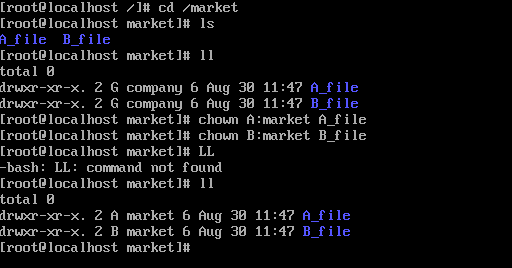
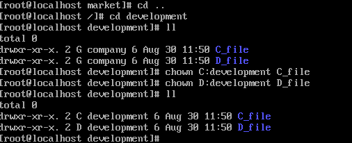

# 文件的权限管理

## 一、使用Linux系统实现

### 1、创建企业组company，市场部market，研发部development和后勤部help


```
groupadd company
groupadd market
groupadd development
groupadd help
```

### 2、创建用户并加入相应的组中


```
useradd -g market -G company A
useradd -g market -G company B
useradd -g development -G company C
useradd -g development -G company D
useradd -g hekp -G company E
useradd -g help -G company F
useradd -g company -G development,market,help G
```

### 3、给创建的用户设置密码


### 4、设置market、development、help所属者为G，所属组为company


```
chown G:company development
chown G:company help
chown G:company market
```

### 5、登录G用户，在目录下创建相应用户的目录


### 6、使用su root 切换root用户登录，更改目录所属用户和组






### 7、更改各用户所属目录权限

#### chmod 750 + 文件名，使得同组其他用户可以访问目录，却不可以修改目录


### 8、验证

#### 例如A用户和B用户在同组，登录到B用户去访问A用户的目录，然后删除，发现可以访问A用户的目录，但删除请求被拒绝了


