# Windows版本

## 一、右键计算机管理，创建用户。

# 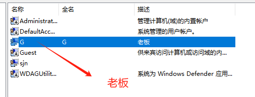

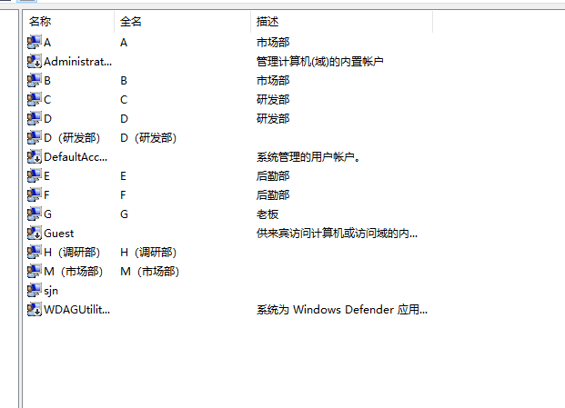!(image-

###       七个用户创建完，方便后续操作。

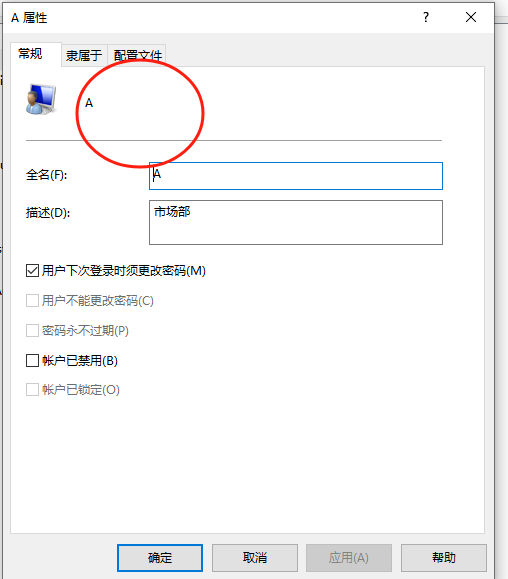

## 二、建立公司文件夹（Company）以及下级文件夹

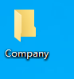

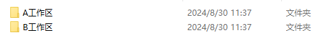

## 三、配置权限

### 老板的权限

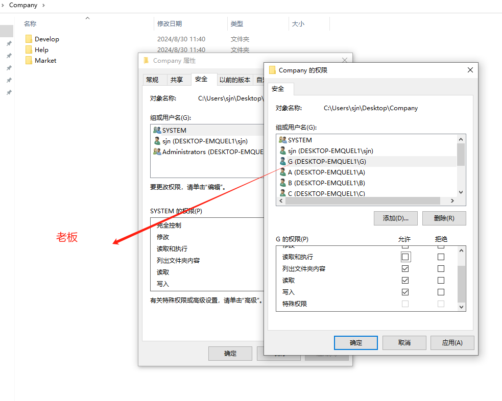

### 员工对company只有只读权限

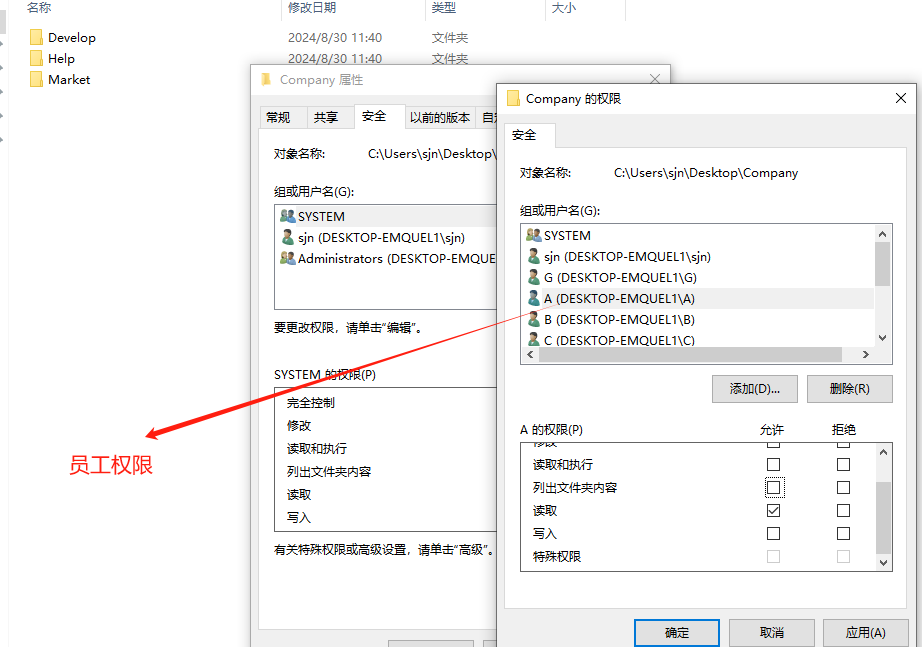

### 老板company权限配置完成

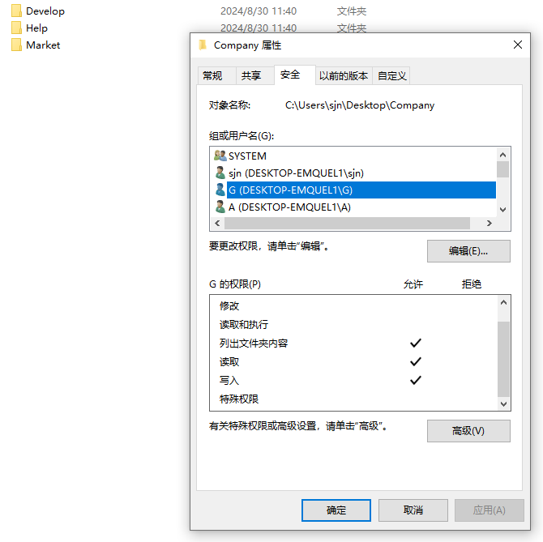

### 员工company权限配置完成

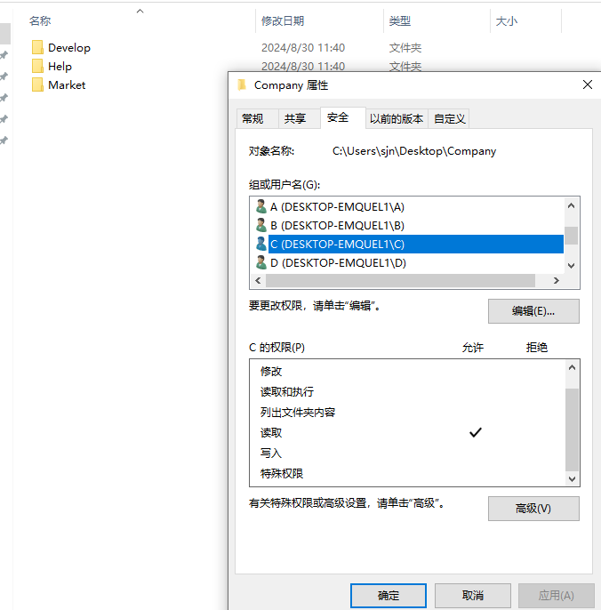

###       二级目录下，所有员工都只有只读权限，每一个员工再自己的工作区，有读写改等权限，在其他同事工作区只有读取权限

#### 例：C在C工作区有如下权限

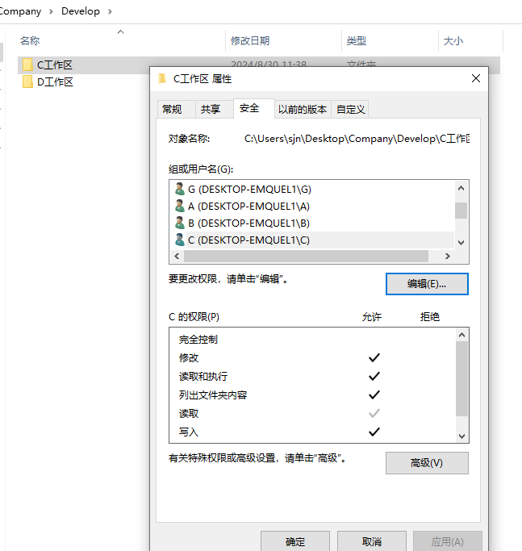

#### 例：D与C是同事，对自己的工作区有与C一样的权限

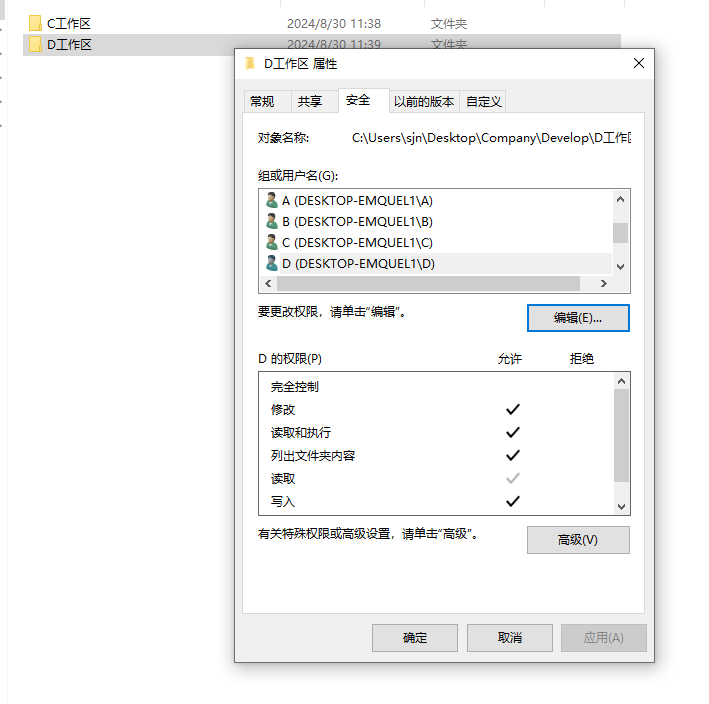

#### 例：A与D,C不在一个部门，故没有权限（Develop）

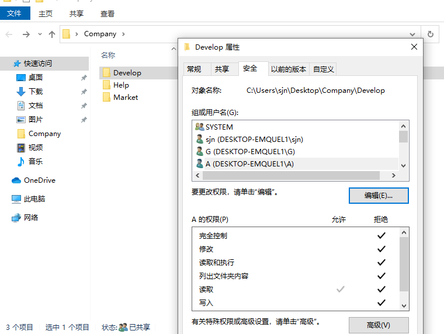

#### 其余两个部门权限配置同上

### 四、权限检验

#### 切换用户，登录用户A

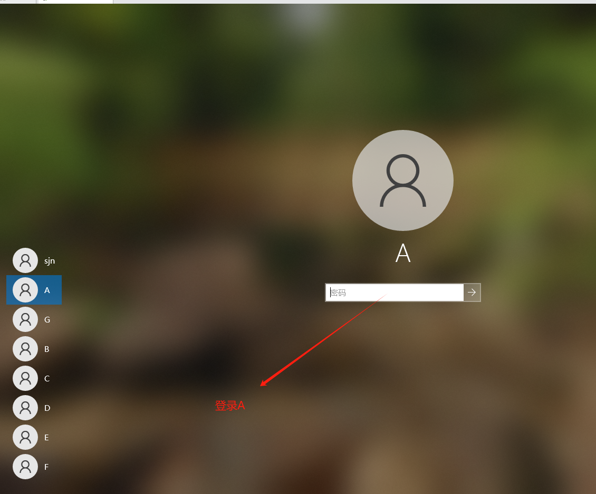

#### 进入Develop，发现进不去（不是找个部门，没有权限）

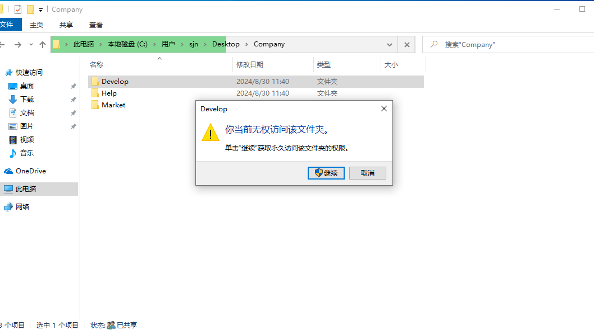

#### 而进Market可以（本部门人员），说明配置成功

#### A进B的工作区写文件，发现不可以（没有写权限）

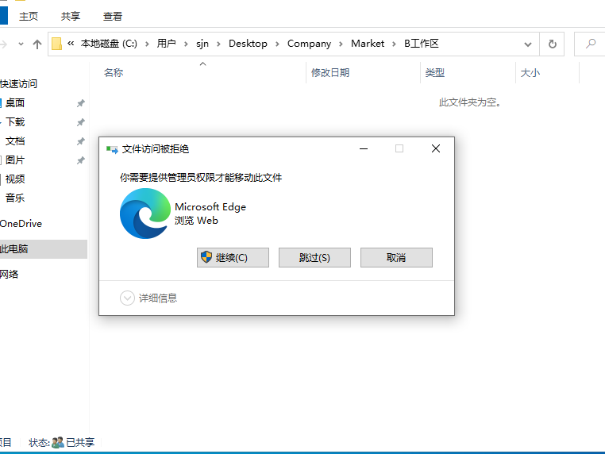

#### 但是在自己的工作区可行（有读写权限）

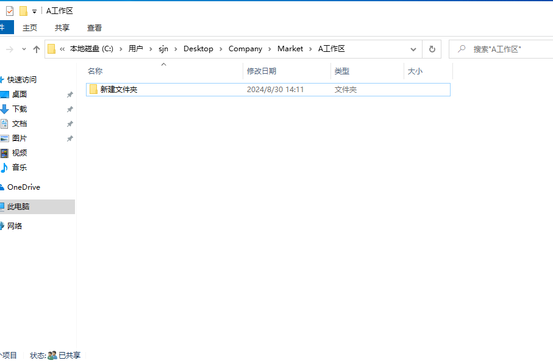

#### 按以上方法测试其他部门

#### 再登录G进行检测，发现所有部门都可以访问，故此文件管理系统配置完毕