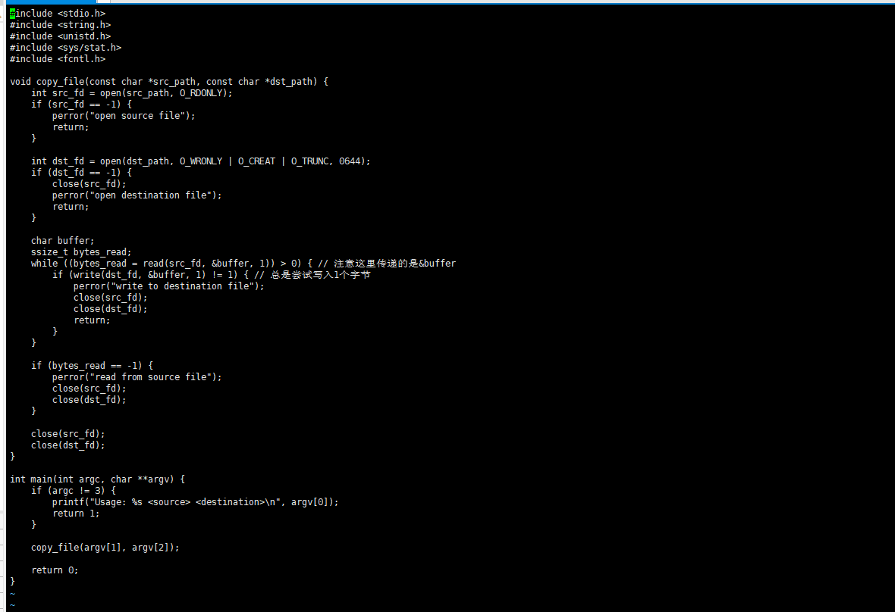
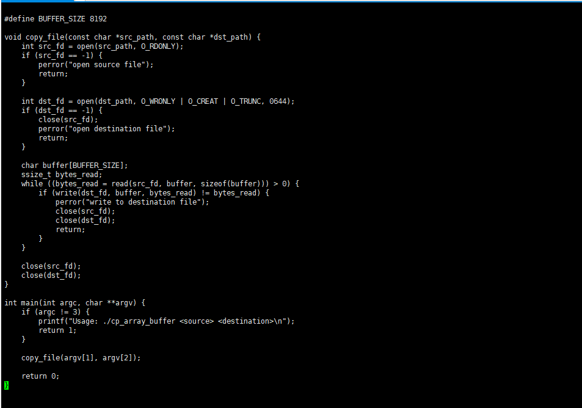
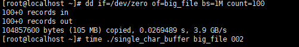
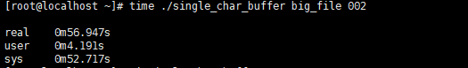
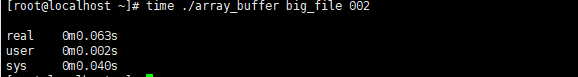

# 一、单字符作为缓冲区

```
[rootelocalhost ~]# vi single_char_buffer.cpp
[rootelocalhost ~]# gcc -o single_char_buffer single_char buffer.cpp
```


### 代码如下

```
#include <stdio.h>
#include <string.h>
#include <unistd.h>
#include <sys/stat.h>
#include <fcntl.h>

void copy_file(const char *src_path, const char *dst_path) {//定义函数
    int src_fd = open(src_path, O_RDONLY);//使用 open 函数尝试以只读模式（O_RDONLY）打开源文件
    if (src_fd == -1) {//错误处理
        perror("open source file");
        return;
    }

    int dst_fd = open(dst_path, O_WRONLY | O_CREAT | O_TRUNC, 0644);//打开（或创建）目标文件；O_WRONLY：以只写模式打开文件；O_CREAT：如果文件不存在，则创建它；O_TRUNC：如果文件已存在，并且以只写或读写模式打开。
0644：设置新创建文件的权限
    if (dst_fd == -1) {//错误处理
        close(src_fd);
        perror("open destination file");
        return;
    }

    char buffer; // 使用单个字符作为缓冲区
    ssize_t bytes_read;
    while ((bytes_read = read(src_fd, &buffer, 1)) > 0) { // 注意这里传递的是&buffer
        if (write(dst_fd, &buffer, 1) != 1) { // 总是尝试写入1个字节
            perror("write to destination file");
            close(src_fd);
            close(dst_fd);
            return;
        }
    }

    // 检查是否因为到达文件末尾而退出循环，而不是因为错误
    if (bytes_read == -1) {
        perror("read from source file");
        close(src_fd);
        close(dst_fd);
    }

    close(src_fd);
    close(dst_fd);
}

int main(int argc, char **argv) {
    if (argc != 3) {//检查命令行参数
        printf("Usage: %s <source> <destination>\n", argv[0]);
        return 1;
    }

    copy_file(argv[1], argv[2]);//调用复制文件函数

    return 0;
}
```




# 二、数组作为缓冲区

```
[rootelocalhost ~]# vi array_buffer.cpp
[rootelocalhost ~]# gcc -o array_buffer array_buffer.cpp
```


### 代码如下

```
#include <stdio.h>
#include <string.h>
#include <unistd.h>
#include <sys/stat.h>
#include <fcntl.h>

#define BUFFER_SIZE 8192

void copy_file(const char *src_path, const char *dst_path) { //定义函数 
    int src_fd = open(src_path, O_RDONLY);//打开源文件
    if (src_fd == -1) {//错误处理
        perror("open source file");
        return;
    }

    int dst_fd = open(dst_path, O_WRONLY | O_CREAT | O_TRUNC, 0644);//打开目标文件 O_WRONLY：以只写模式打开； O_CREAT：如果指定的文件不存在，则创建它；O_TRUNC：如果文件已存在，并且以只写或读写模式成功打开，则将其长度截断为零；0644：文件的权限模式
    if (dst_fd == -1) {//错误处理
        close(src_fd);
        perror("open destination file");
        return;
    }

    char buffer[BUFFER_SIZE];//定义一个字符数组（缓冲区）buffer
    ssize_t bytes_read;//读取源文件
    while ((bytes_read = read(src_fd, buffer, sizeof(buffer))) > 0) {
        if (write(dst_fd, buffer, bytes_read) != bytes_read) {//写入目标文件
            perror("write to destination file");//错误处理
            close(src_fd);
            close(dst_fd);
            return;
        }
    }

    close(src_fd);
    close(dst_fd);
}

int main(int argc, char **argv) {
    if (argc != 3) {//参数检查
        printf("Usage: ./cp_array_buffer <source> <destination>\n");
        return 1;
    }

    copy_file(argv[1], argv[2]);//文件复制

    return 0;
}
~   
```




# 三、使用以下命令生成一个文件

```
[root@localhost ~]# dd if=/dev/zero of=big_file bs=1M count=100
100+0 records in
100+0 records out
104857600 bytes (105 MB) copied, 0.0269489 s, 3.9 GB/s
[root@localhost ~]# time ./single_char_buffer big_file 002
```



# 四、分别用两种方式将生成的文件复制到002文件，并用time命令查看运行时间


```
[root@localhost ~]# time ./single_char_buffer big_file 002
[root@localhost ~]# time ./array_buffer big_file 002
```




### 发现数组缓冲区的运行速度明显比单字符缓冲区的运行速度快

# 五、将缓冲区改为大于8192（8193）



### 发现运行时间增加

| 姓名    | 具体工作   | 分数 |
| ------- | ---------- | ---- |
| 苏嘉诺  | 编写数组   | 8    |
| 刘少杰  | 编写单字符 | 8    |
| 倪涛    | 文档整理   | 8    |
| 王晓佳  | 文档整理   | 8    |
| 王小鹏  | 查阅资料   | 7    |
| 程   宇 | 查阅资料   | 7    |
| 吕仕通  | 编写框架   | 8    |


