# linux系统基础 综合作业

## 一、实验要求

#### 创建自己的工具箱mytools，  通过工具箱快速调用自己创建的工具，如  查看文件状态的  mystat(仿stat)   ，   查看目录列表的  myls （仿ls -lia）  ，    复制文件的mycp（仿cp能拷贝文件即可），  查看当前系统内存信息   mymi（读取 /proc/meminfo）

## 二、理论依据

#### 创立四个.c文件，编写程序分别为mystst.c，myls.c，mycp.c，myml.c，分别对其编译。创立一个工具箱（004），通过exec进行系统调用，来达到实现工具箱中输入如下指令可执行的目的，并且在任意目录下可执行。

```shell
# mytools myls /etc
# mytools mystat /etc/passwd
# mytools mycp /etc/passwd  ./passwd.bak
# mytools mymi
```

## 三、进程前驱图

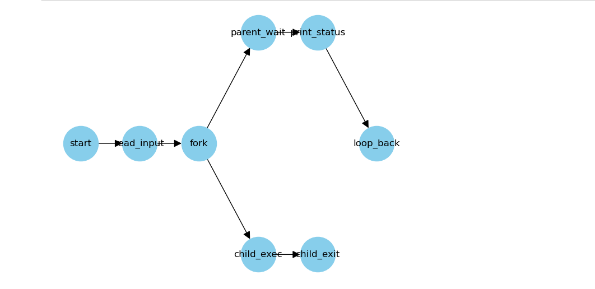

## 四、具体实现流程

### 1.mycp工具

#### (1)编写mycp.c

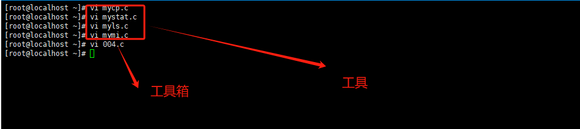

```c
#include <stdio.h>  
#include <stdlib.h>  
#include <string.h>  
#include <sys/types.h>  
#include <sys/stat.h> 
#include <fcntl.h> 
#include <unistd.h>  
  
#define BUFFER_SIZE 4096   
  
int main(int argc, char *argv[]) {  
    char *sourceFile, *destFile;// 声明源文件和目标文件的指针  
    char buffer[BUFFER_SIZE];   // 声明缓冲区  
    ssize_t nread; // 声明用于存储read函数返回值的变量，ssize_t是signed size_t的缩写，可以存储有符号的大小   
    int inFile, outFile;  // 声明用于存储打开文件描述符的变量  
  
    if (argc != 3) {   // 检查命令行参数数量 
        fprintf(stderr, "Usage: %s <source file> <destination file>\n", argv[0]); // 如果参数数量不正确，打印使用说明   
        return EXIT_FAILURE;  
    }  
  
    sourceFile = argv[1];  // 获取源文件路径
    destFile = argv[2];   // 获取目标文件路径
 
    inFile = open(sourceFile, O_RDONLY); // 以只读模式打开源文件 
    if (inFile == -1) {  
        perror("Failed to open source file");  
        return EXIT_FAILURE;  
    }  
  
    
    outFile = open(destFile, O_WRONLY | O_CREAT | O_TRUNC, S_IRUSR | S_IWUSR | S_IRGRP | S_IWGRP); // 以只写模式打开或创建目标文件，设置权限为读写用户和用户组    
    if (outFile == -1) { // 如果打开或创建失败  
        perror("Failed to open or create destination file");  
        close(inFile);  
        return EXIT_FAILURE;  
    }  
  
    while ((nread = read(inFile, buffer, BUFFER_SIZE)) > 0) {  // 循环读取源文件内容到缓冲区  

        if (write(outFile, buffer, nread) != nread) { // 将缓冲区内容写入目标文件  
            perror("Failed to write to destination file");  
            close(inFile);  
            close(outFile);  
            return EXIT_FAILURE;  
        }  
    }  
       
    if (nread == -1) {  // 如果读取失败
        perror("Error reading from source file");  // 打印错误信息  
        close(inFile);   close(inFile);  // 关闭已打开的源文件  
        close(outFile);  
        return EXIT_FAILURE;  
    }  
    
    close(inFile); // 关闭已打开的源文件  
    close(outFile);   // 关闭已打开的目标文件 
  
    return EXIT_SUCCESS;  // 程序成功执行完毕  
}

```

#### (2)编译mycp.c

#### 

```shell
# gcc -o mycp mycp.c
```

### 2.mystat工具

#### (1)编写mystat.c

#### 

```c
#include <stdio.h>  
#include <stdlib.h> 
#include <sys/stat.h>
#include <sys/types.h> 
#include <unistd.h>   
#include <string.h>   
#include <pwd.h> 
#include <grp.h>  
   
void printStatInfo(const struct stat *buf, const char *filename);    
  
int main(int argc, char *argv[]) {    
    struct stat fileInfo;  // 定义一个stat结构体变量，用于存储文件状态信息  
    int result;  // 定义一个整型变量，用于存储stat函数的返回值  
    if (argc != 2) {  // 检查命令行参数数量是否正确  
        fprintf(stderr, "Usage: %s <filename>\n", argv[0]);  // 如果不正确，打印使用说明  
        return EXIT_FAILURE; 
    }    
    result = stat(argv[1], &fileInfo);  // 调用stat函数获取文件状态信息  
    if (result == -1) {  // 如果stat函数调用失败  
        perror("Error getting file status");  // 打印错误信息  
        return EXIT_FAILURE; 
    }    
    printStatInfo(&fileInfo, argv[1]);  // 调用printStatInfo函数打印文件状态信息  
    return EXIT_SUCCESS;    
}  
  
// printStatInfo函数的实现  
void printStatInfo(const struct stat *buf, const char *filename) {    
    const char *username = "unknown";  // 初始化用户名为"unknown"  
    const char *groupname = "unknown";  // 初始化组名为"unknown"  
    struct passwd *pw = getpwuid(buf->st_uid);  // 通过用户ID获取用户信息  
    if (pw != NULL) {  // 如果获取成功  
        username = pw->pw_name;  // 更新用户名为实际用户名  
    }    
    struct group *gr = getgrgid(buf->st_gid);  // 通过组ID获取组信息  
    if (gr != NULL) {  // 如果获取成功  
        groupname = gr->gr_name;  // 更新组名为实际组名  
    }    
    char perms[11] = {0};   // 初始化权限字符串  
    printf("File: '%s'\n", filename);  // 打印文件名  
    printf("Size: %ld bytes\n", (long)buf->st_size);  // 打印文件大小  
    printf("Inode: %lu\n", (unsigned long)buf->st_ino);  // 打印inode号  
    printf("Type: ");  // 打印文件类型前的提示  
    switch (buf->st_mode & S_IFMT) {    
       case S_IFREG:  
            printf("regular\n");  
            break;   
    }      
    printf("Links: %ld\n", (long)buf->st_nlink);  // 打印链接数  
    printf("UID: %ld (%s)\n", (long)buf->st_uid, username);  // 打印用户ID和用户名  
    printf("GID: %ld (%s)\n", (long)buf->st_gid, groupname);  // 打印组ID和组名  
      
    switch (buf->st_mode & S_IFMT) {    
        case S_IFDIR:    
            perms[0] = 'd';  // 目录类型文件以'd'开头  
            break;    
        case S_IFREG:    
            perms[0] = '-';  // 普通文件以'-'开头  
            break;    
    }    
    int i = 1;   
    // 依次检查并设置文件的所有者、组和其他用户的读、写、执行权限  
    if (buf->st_mode & S_IRUSR) perms[i++] = 'r'; else perms[i++] = '-';    
    if (buf->st_mode & S_IWUSR) perms[i++] = 'w'; else perms[i++] = '-';    
    if (buf->st_mode & S_IXUSR) perms[i++] = 'x'; else perms[i++] = '-';    
    perms[i] = '\0';  // 确保权限字符串以空字符结尾  
      
    char perms_octal[5];  // 用于存储八进制权限的字符串  
    sprintf(perms_octal, "%04o", (buf->st_mode & 0777));  // 将权限转换为八进制并存储在perms_octal中  
    printf("Access: (%s|%s)\n", perms_octal, perms);  // 打印八进制权限和符号权限  
}
```

#### (2)编译mystat.c

##### 

```shell
#gcc _o mystat mystat.c
```

### 3.myls工具

#### (1)编写myls.c


```c
#include <sys/types.h
#include <sys/stat.h>  
#include <unistd.h>  
#include <stdio.h>    
#include <dirent.h>   
#include <string.h>    
#include <stdlib.h>     
  
int main(int argc, char *argv[]) { // 定义主函数，接收命令行参数  
    DIR *dir_ptr; // 声明一个指向DIR结构体的指针，用于表示目录流  
    struct dirent *direntp; // 声明一个指向dirent结构体的指针，用于表示目录中的条目  
    struct stat statbuf; // 声明一个stat结构体变量，用于存储文件状态信息  
  
    if (argc != 2) { // 检查命令行参数数量是否为2  
        fprintf(stderr, "Usage: %s <directory>\n", argv[0]); // 如果不是，打印使用方法并退出  
        return 1; // 返回1表示异常退出  
    }  
    
    if ((dir_ptr = opendir(argv[1])) == NULL) { // 尝试打开用户指定的目录  
        perror("Cannot open directory"); // 如果打开失败，打印错误信息  
        return 1; // 返回1表示异常退出  
    }  
   
    while ((direntp = readdir(dir_ptr)) != NULL) { // 遍历目录中的每个条目  
        char filepath[1024]; // 声明一个字符数组，用于存储完整的文件路径  
     
        if (strcmp(direntp->d_name, ".") == 0 || strcmp(direntp->d_name, "..") == 0)  
            continue; // 跳过当前目录（.）和上级目录（..）  
  
        snprintf(filepath, sizeof(filepath), "%s/%s", argv[1], direntp->d_name); // 构造完整的文件路径  
  
        if (stat(filepath, &statbuf) == -1) { // 尝试获取文件状态信息  
            perror("stat"); // 如果失败，打印错误信息  
            continue; // 跳过当前条目，继续下一个  
        }  
      
        char filetype; // 声明一个字符变量，用于表示文件类型  
        switch (statbuf.st_mode & S_IFMT) { // 使用位与操作获取文件类型  
            case S_IFDIR:  
                filetype = 'd'; // 目录  
                break;  
            case S_IFCHR:  
                filetype = 'c'; // 字符设备  
                break;  
            case S_IFBLK:  
                filetype = 'b'; // 块设备  
                break;  
            case S_IFLNK:  
                filetype = 'l'; // 符号链接  
                break;  
            case S_IFREG:  
            default:  
                filetype = '-'; // 常规文件或其他  
                break;  
        }  
   
        unsigned long long filesize = (unsigned long long)statbuf.st_size; // 获取文件大小  
  
        char filesize_str[21]; // 声明一个字符数组，用于存储文件大小的字符串表示  
        snprintf(filesize_str, sizeof(filesize_str), "%llu", filesize); // 将文件大小转换为字符串  
  
        printf("%11ld\t%c\t\tUID: %d\tGID: %d\t%s\t%s\n", // 打印文件信息  
               statbuf.st_ino, // 文件的inode号  
               filetype, // 文件类型  
               statbuf.st_uid, // 文件所有者的用户ID  
               statbuf.st_gid, // 文件所有者的组ID  
               filesize_str, // 文件大小  
               direntp->d_name); // 文件名  
    }   
    closedir(dir_ptr);   
    return 0;   
}
```

#### (2)编译myls.c

##### 

```shell
# gcc -o myls myls.c
```

### 4.mymi工具

#### (1)编写mymi.c


```c
#include <stdio.h>   
#include <stdlib.h>  
#include <fcntl.h>   
#include <unistd.h>   
#include <string.h> 
  
#define BUFFER_SIZE 1024 // 定义缓冲区大小为1024字节  
  
int main(int argc, char *argv[]) {  
    char buffer[BUFFER_SIZE]; // 声明一个字符数组作为缓冲区，用于存储从文件中读取的数据  
    ssize_t bytesRead; // 声明一个变量，用于存储每次从文件中读取的字节数  
    int fd; // 声明一个文件描述符变量  
  
    fd = open("/proc/meminfo", O_RDONLY); // 尝试以只读方式打开/proc/meminfo文件，并将文件描述符赋给fd  
    if (fd == -1) { // 如果文件打开失败（即fd为-1）  
        perror("Error opening /proc/meminfo"); 
        return EXIT_FAILURE;  
    }  
  
    while ((bytesRead = read(fd, buffer, BUFFER_SIZE - 1)) > 0) { // 循环读取文件内容，直到读取到文件末尾  
        buffer[bytesRead] = '\0'; // 在读取的数据末尾添加字符串结束符'\0'，确保buffer是一个有效的C字符串  
        char *line = strtok(buffer, "\n"); // 使用strtok函数以换行符为分隔符，分割buffer中的字符串，并将第一个分割出的字符串的地址赋给line  
  
        while (line != NULL) { // 循环遍历buffer中的所有行  
            if (strstr(line, "MemTotal:") != NULL || // 如果行中包含"MemTotal:"  
                strstr(line, "MemFree:") != NULL || // 或者包含"MemFree:"  
                strstr(line, "MemAvailable:") != NULL || // 或者包含"MemAvailable:"  
                strstr(line, "Buffers:") != NULL || // 或者包含"Buffers:"  
                strstr(line, "Cached:") != NULL || // 或者包含"Cached:"  
                strstr(line, "SwapCached:") != NULL || // 或者包含"SwapCached:"  
                strstr(line, "SwapTotal:") != NULL || // 或者包含"SwapTotal:"  
                strstr(line, "SwapFree:") != NULL) { // 或者包含"SwapFree:"  
  
                printf("%s\n", line); // 打印符合条件的行  
            }  
  
            line = strtok(NULL, "\n"); // 继续使用strtok函数，分割下一个字符串（即下一行）  
        }  
    }  
  
    if (bytesRead == -1) { // 如果read函数返回-1，表示读取文件时发生错误  
        perror("Error reading from /proc/meminfo");  
        close(fd);  
        return EXIT_FAILURE;  
    }  
  
    close(fd);  
    return EXIT_SUCCESS; 
}
```

#### (2)编译mymi.c

#### 

```shell
# gcc -o mymi mymi.c
```

### 5.工具箱（004）

#### (1)编写004.c


```c
#include <stdio.h> 
#include <stdlib.h>  
#include <string.h>  
#include <unistd.h> 
#include <sys/wait.h>
  
#define BUFFER_SIZE 1024  
  
int main() {    
    char buffer[BUFFER_SIZE];  // 定义一个字符数组，用于存储从标准输入读取的命令  
    char *args[BUFFER_SIZE / 2]; // 定义一个字符串指针数组，用于存储分割后的命令参数  
    int argc;  // 用于记录命令参数的数量  
    
    printf("mytools ");  // 初始化时打印提示符  
    
    while (1) {  // 进入无限循环，等待用户输入  
        if (fgets(buffer, BUFFER_SIZE, stdin) == NULL) {  // 从标准输入读取一行文本  
            perror("fgets failed");  // 如果读取失败，打印错误信息  
            break;   
        }    
    
        buffer[strcspn(buffer, "\n")] = 0;  // 移除字符串末尾的换行符  
    
        argc = 0;  // 重置参数计数器  
        args[argc++] = strtok(buffer, " \t\n");  // 使用strtok分割字符串，获取第一个参数  
    
        while (argc < BUFFER_SIZE / 2 && (args[argc++] = strtok(NULL, " \t\n")) != NULL) {    
            // 继续分割字符串，直到没有更多参数或达到数组容量限制  
        }    
    
        if (argc == 0) {  
            continue;    
        }    
    
        pid_t pid = fork();  // 创建一个子进程  
    
        if (pid == -1) {  // 如果fork失败  
            perror("fork failed");  // 打印错误信息  
            continue;  // 跳过后续操作，继续循环  
        }    
    
        if (pid == 0) {  // 如果当前进程是子进程  
            printf("Executing: %s\n", args[0]);  // 打印将要执行的命令  
            execvp(args[0], args);  // 尝试执行命令  
            // 如果execvp执行成功，则不会执行到这一行。如果失败，则执行下面的代码  
            perror("execvp failed");  // 打印错误信息  
            _exit(EXIT_FAILURE);  // 终止子进程，并返回失败状态  
        }   
    
        // 父进程部分  
        int status;    
        if (waitpid(pid, &status, 0) == -1) {  // 等待子进程结束，并获取其状态  
            perror("waitpid failed");  // 如果等待失败，打印错误信息  
            continue;  // 跳过后续操作，继续循环  
        }    
    
        // 根据子进程的退出状态打印相应信息  
        if (WIFEXITED(status)) {  // 如果子进程正常退出  
            printf("Child exited with status %d\n", WEXITSTATUS(status));    
        } else if (WIFSIGNALED(status)) {  // 如果子进程被信号终止  
            printf("Child killed by signal %d\n", WTERMSIG(status));    
        }    
    
        printf("mytools ");  // 打印提示符，准备接收下一次输入  
    }    
    
    return 0;  
}

```

#### (2)编译004.c

##### 

```shell
# gcc -o 004 004.C
```

#### (3)创立mytools目录

##### 

```shell
mkdir mytools
```

#### (4)将004,mycp,mystat,myls,mymi复制到mytools目录下

##### 

```shell
cp mycp mytools/
cp mymi mytools/
cp mystat mytools/
cp myls mytools/
```

#### 

```shell
cp 004 mytools/
```


#### (5)将~/mytools加入到环境变量并保存

#### 

```shell
# vi  /etc/prof i le
```

#### 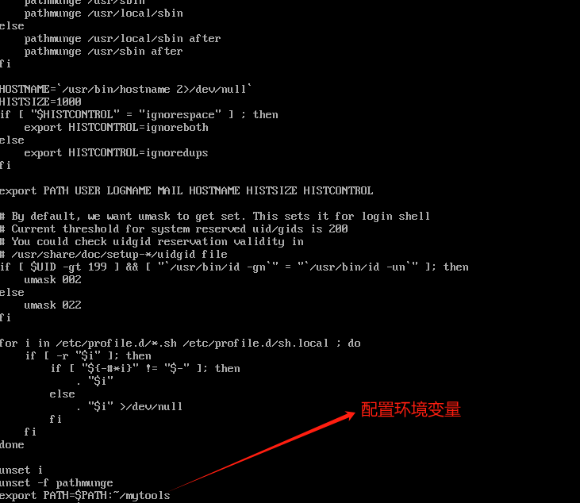

## 五、验证过程及结论

#### 1.在~下输入004，键入相关命令，与系统命令对比

### mystat

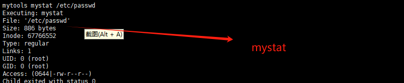

### 系统stat

#### 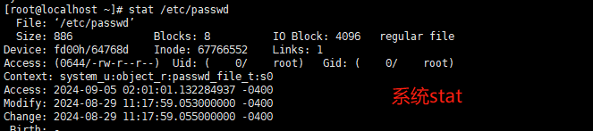

#### 结论：进过对比发现mystat执行成功

### mycp

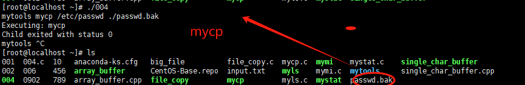

### 系统cp


#### 结论：经过对比发现mycp命令拷贝成功

### mymi

#### 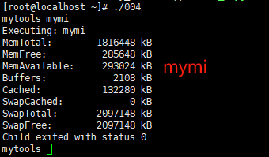

### 系统meminfo

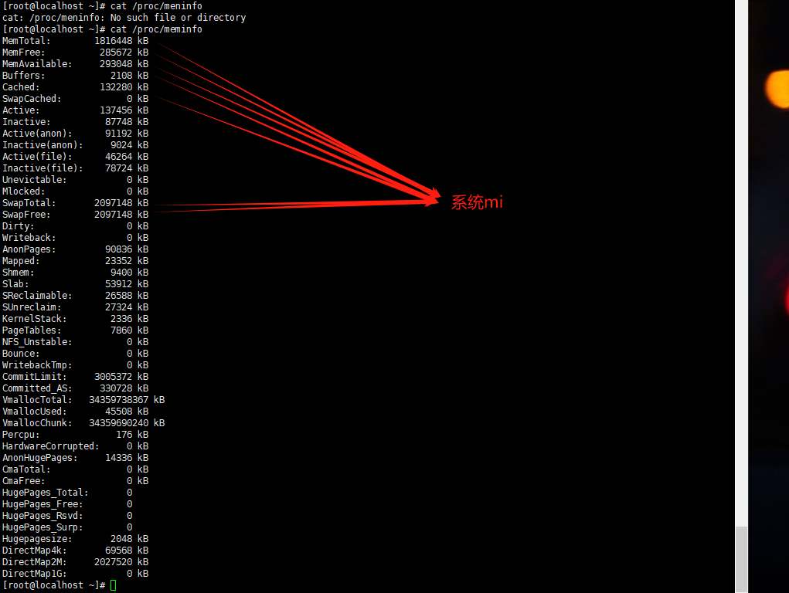

#### 结论：经过对比发现mymi显示成功

### myls

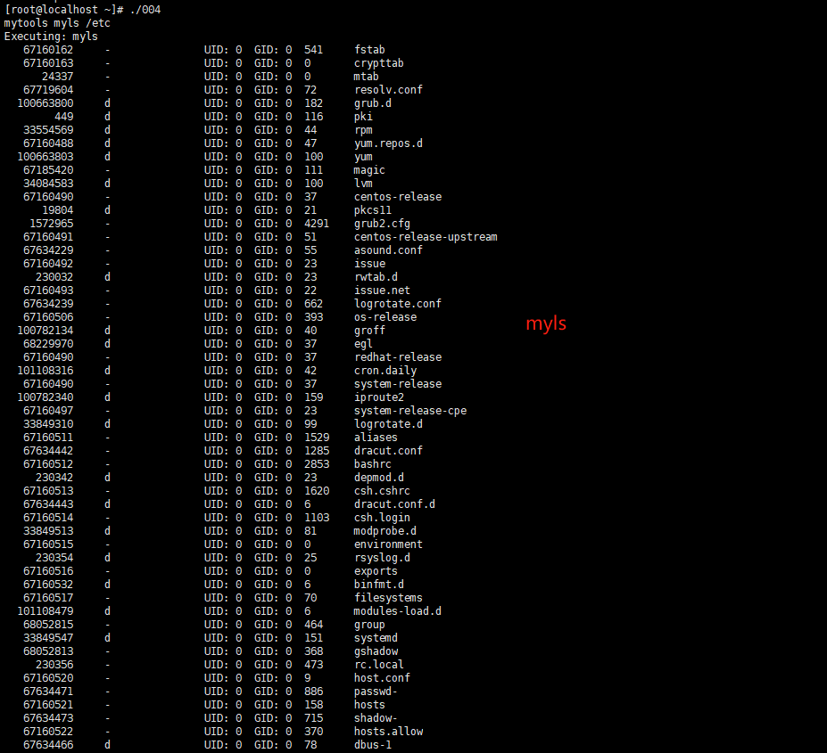

#### 系统ls -lia /etc

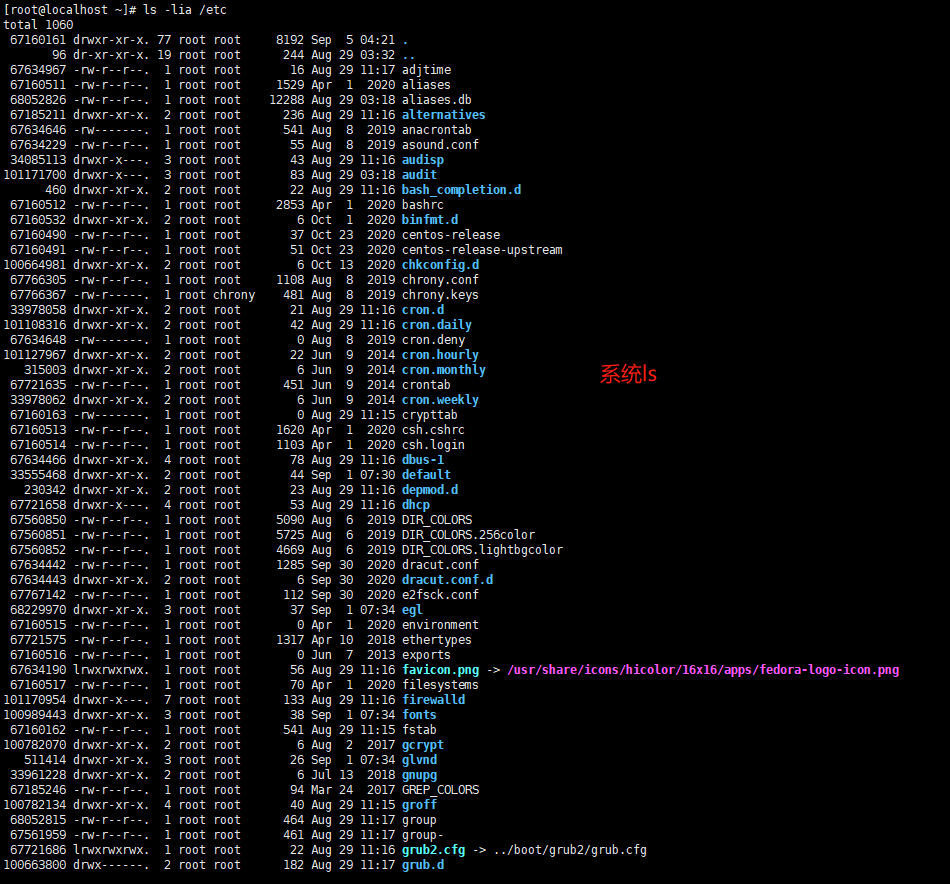

#### 结论：经过对比发现myls与系统一致

### 2.使用cd切换目录，验证在不同目录下工具箱能否实现

### 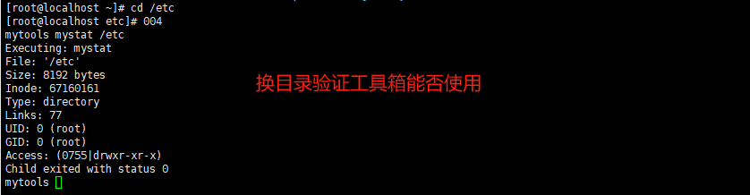

#### 结论：切换到etc目录下，工具箱mytools依旧可以运行，故此工具箱可以在任意目录下运行

| 成员姓名 | 具体工作                                 | 评分 |
| -------- | ---------------------------------------- | ---- |
| 苏嘉诺   | mystat,mycp,mytools                      | 105  |
| 刘少杰   | myls mymi                                | 104  |
| 吕仕通   | 前驱图                                   | 96   |
| 倪涛     | 整理文档                                 | 103  |
| 王晓佳   | 整理文档                                 | 103  |
| 程宇     | 美工                                     | 95   |
| 聂晓伟   | 调试程序                                 | 95   |
| 王小鹏   | 检查错误调试程序，编写调试，编写环境变量 | 106  |

