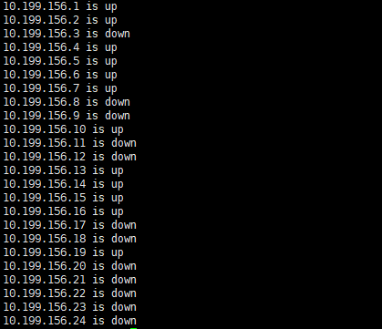
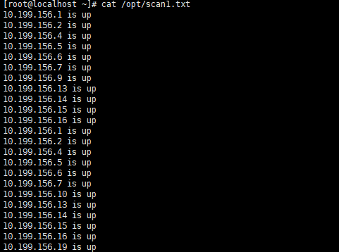

# 课堂实践：  

##### 实现一个扫描指定网段存活主机的脚本。要求提供至少2层的数据流图， 脚本实现过程并且通过注释解释脚本功能。

一、脚本实现过程

(1)运行脚本

```
[root@localhost ~]# ./scan1.sh 
please input xx.xx.xx : 
```

# 

(2)按提示输入网段，IP地址起始位，结束位

```
please input xx.xx.xx : 10.199.156
please input first :1
please input end :24
```

# 

(3)扫描开始

# 

(4)查看扫描出的文件

```
[root@localhost ~]# cat /opt/scan1.txt
```

# 

(5)代码注释

```
#!/bin/bash

# 读取用户输入的网络前缀
read -p "please input xx.xx.xx (network prefix): " net_ip
# 读取用户输入的起始IP的最后一段
read -p "please input first IP segment (start): " start_ip
# 读取用户输入的结束IP的最后一段
read -p "please input end IP segment (end): " end_ip

# 使用for循环遍历从起始IP到结束IP的每个数字
# 注意：这里假设start_ip和end_ip都是有效的数字，并且没有进行输入验证
for ((i=$start_ip; i<=$end_ip; i++))
do
  # &> /dev/null 表示将ping命令的输出（包括标准输出和标准错误）重定向到/dev/null，即忽略它们
  `ping -c 2 -i 0.1 -w 2 $net_ip.$i &> /dev/null`

  # 检查上一个命令（即ping命令）的退出状态
  if [ $? -eq 0 ];
  then
    # 如果ping命令成功（即$?等于0），则IP地址在线
    echo "$net_ip.$i is up " >> "/opt/scan1.txt" # 将结果追加到/opt/scan1.txt文件中
    echo "$net_ip.$i is up"                     # 屏幕输出
  else
    # 如果ping命令失败（即$?不等于0），则IP地址不在线
    echo "$net_ip.$i is down"                   # 只在屏幕输出不在线的IP地址
  fi
done

```

二、数据流图

### 整体数据流

```plaintext
┌─────────────┐
│ User Input  │
│ (STDIN)     │
│   net_ip    │
│   start_ip  │
│   end_ip    │
└────┬────────┘
     │
     ▼
┌─────────────┐
│ Script Logic│
│ (Bash)      │
│   Loop      │
│   Ping      │
│   Check     │
│   Redirect  │
└────┬────────┘
     │
     ▼
┌─────────────┐
│ Output      │
│ (STDOUT,    │
│  /opt/scan1.txt)│
│   IP Status │
└─────────────┘
```

### 细节数据流（在Script Logic内）

```plaintext
[Loop Start]
    │
    ▼
┌─────────────┐
│ Ping Command│
│ (Bash)      │
│   $net_ip.$i│
│   -c 2 -i 0.1│
│   -w 2 &> /dev/null│
└────┬────────┘
     │
     ▼
┌─────────────┐
│ Check $?    │
│ (Bash)      │
│ if [ $? -eq 0 ] │
└────┬────────┘
     │
     ├───┬───┐
     │   │   │
     ▼   ▼   ▼
┌─────────────┐  ┌─────────────┐  ┌─────────────┐
│ IP is up    │  │ IP is down  │  │ Redirect    │
│ Echo to     │  │ Echo to     │  │ to File     │
│ STDOUT      │  │ STDOUT      │  │ /opt/scan1.txt│
│ (if ping OK)│  │ (if ping fail)│  │ (if ping OK)│
└─────────────┘  └─────────────┘  └─────────────┘

[Loop Continue/End]
```


