# 课堂实践：   磁盘系统管理和配额管理

## windows平台

### 一、打开Hyper-v，在win-server 2003中添加四个虚拟硬盘

# 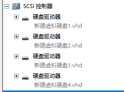

### 二、打开磁盘管理

# 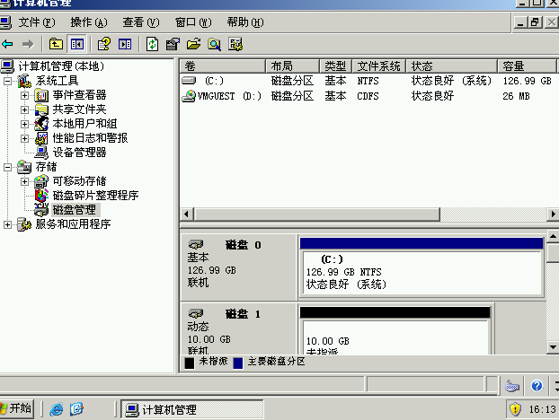

### 三、依次新建卷（如图）

```
RAID 0（条带化）: 数据被分割成块并分布在所有磁盘上，提高读写性能，但没有数据冗余，一旦一个磁盘失败，所有数据都会丢失。
RAID 1（镜像）: 数据被完全复制到另一个磁盘上，提供数据冗余，但牺牲了空间效率（每个磁盘存储相同的数据）。
RAID 5（分布式奇偶校验）: 数据和奇偶校验信息分布在所有磁盘上，提供数据冗余和较好的读写性能，比 RAID 1 节省空间。
```

### 四、建立成功

# 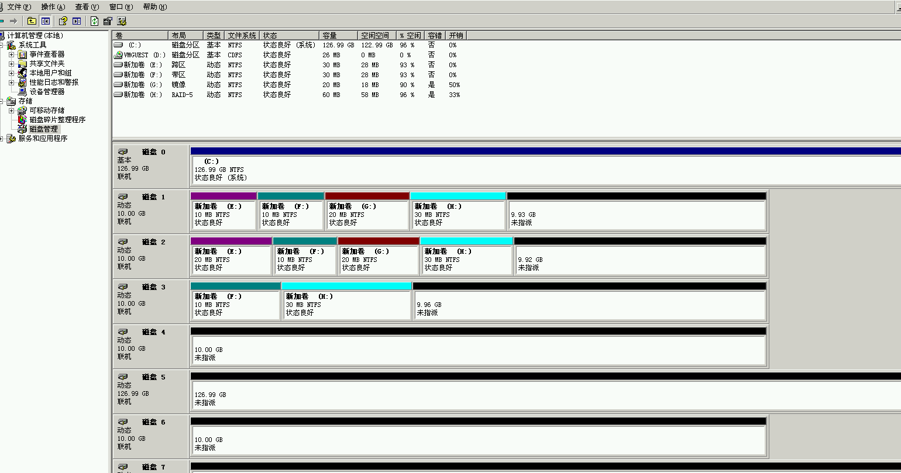

### 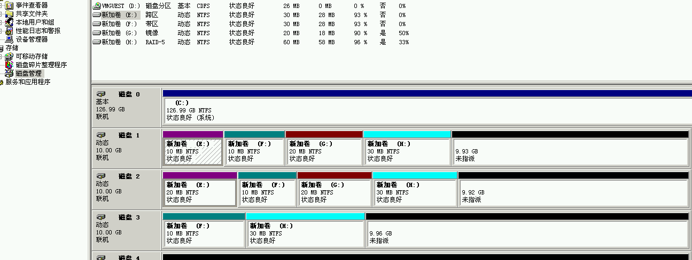

### 五、验证

#### 删除磁盘1，发现磁盘不能用了

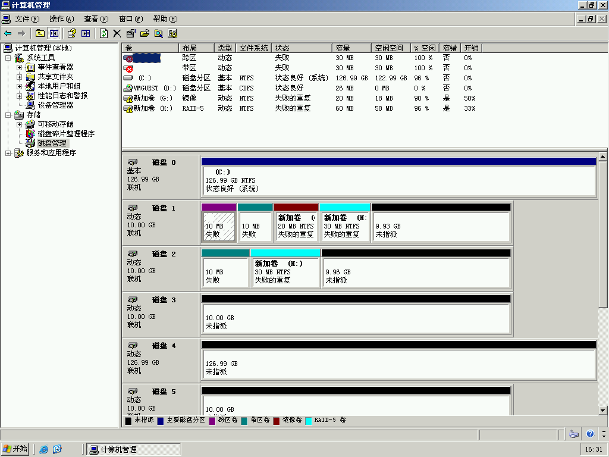


#### 修复卷镜像，和raid-5卷

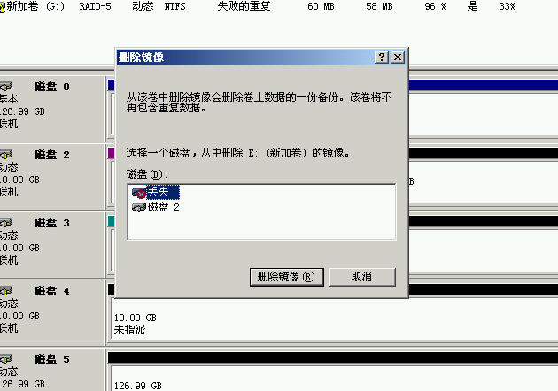

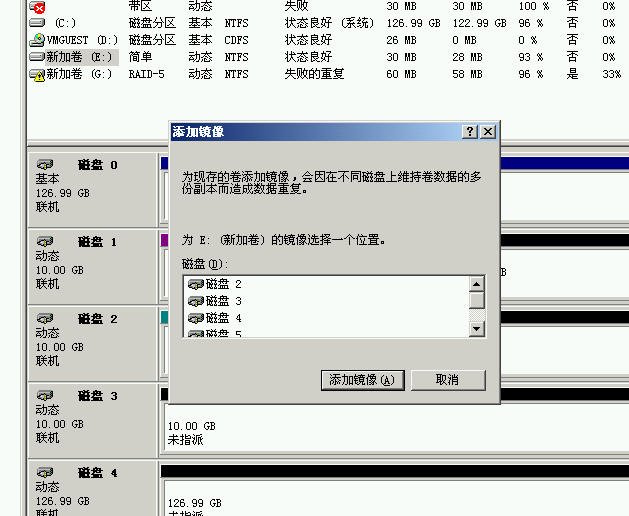

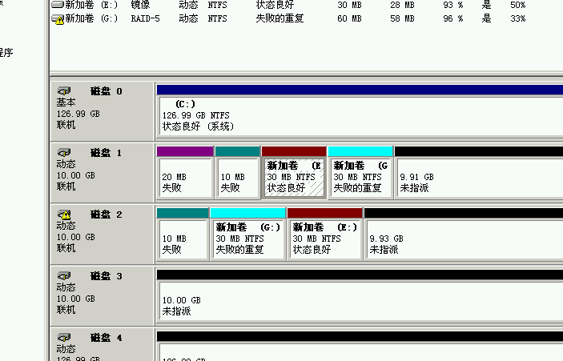

修复成功镜像

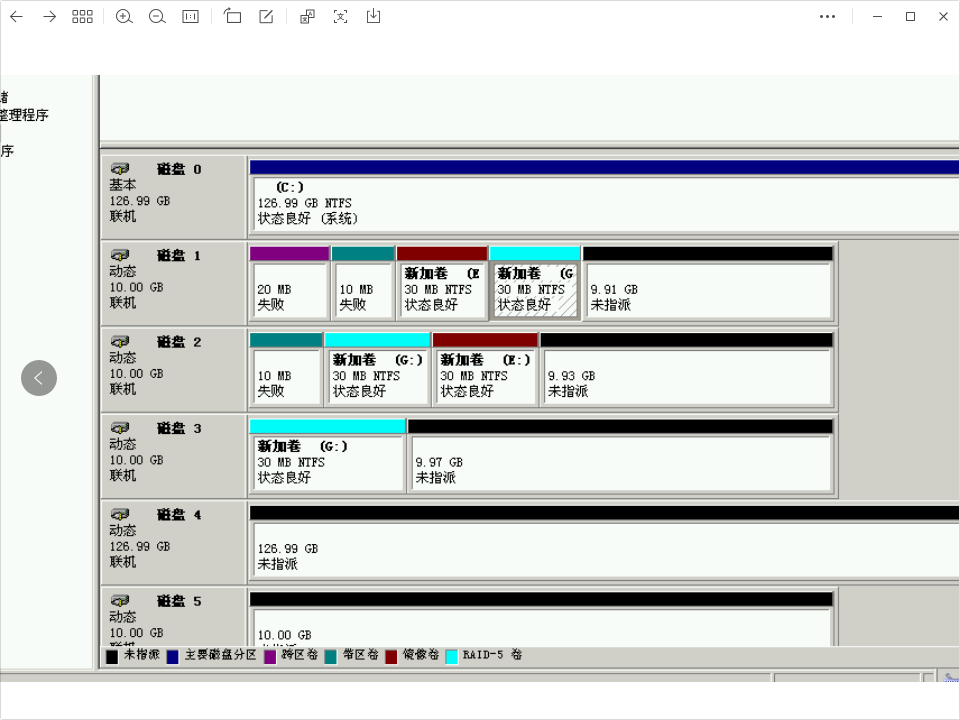

#### 修复成功raid-5

#### 发现这两可修复，而跨区带区不可修复

### 六、配额

设置配额

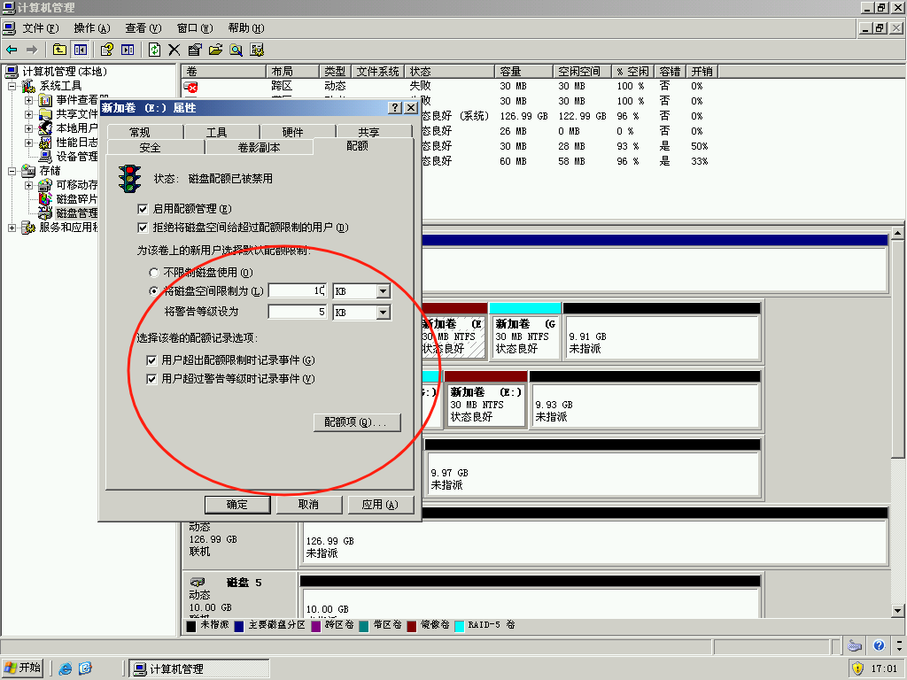

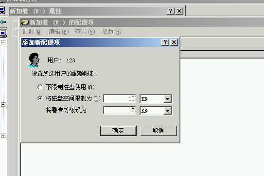

#### 新建一个空文件发现可以

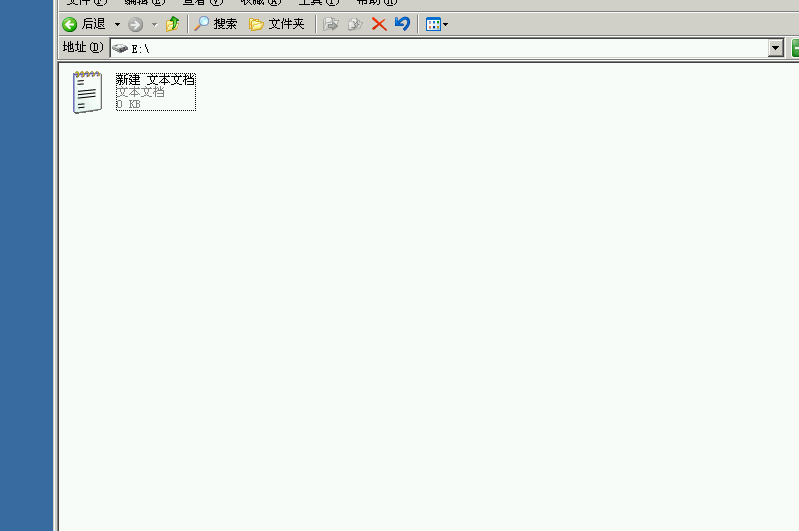

#### 创立一个大于限额的文件发现日志提醒了

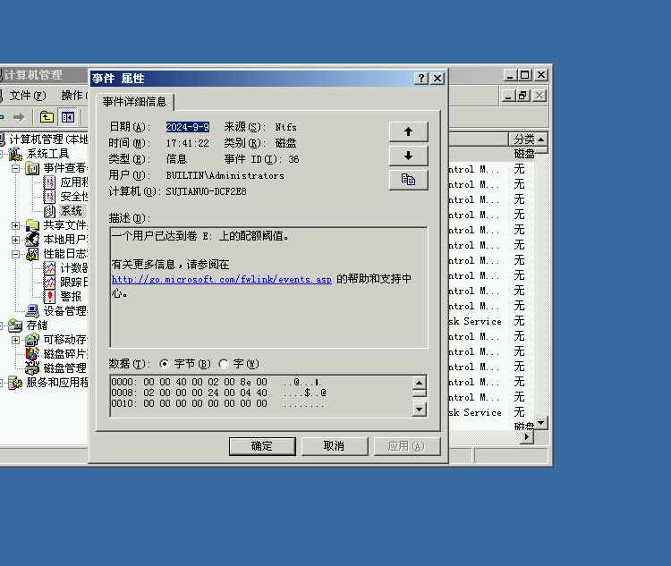

## Linux平台

## **磁盘系统管理和配额管理（Linux）**

### 一、添加虚拟硬盘


### 二、查看磁盘情况并创建Raid0、Raid1和Raid5


```
sudo mdadm --create --verbose /dev/md0 --level=0 --raid-devices=2 /dev/sdb /dev/sdc
sudo mdadm --create --verbose /dev/md1 --level=1 --raid-devices=2 /dev/sdd /dev/sde
sudo mdadm --create --verbose /dev/md5 --level=5 --raid-devices=3 /dev/sdf /dev/sdg /dev/sdh
```

#### 保存配置文件


```
sudo mdadm --detail --scan | sudo tee -a /etc/mdadm/mdadm.conf
```

### 三、为每个RAID设备创建物理卷


```
pvcreate /dev/md0  
pvcreate /dev/md1  
pvcreate /dev/md5
```

### 四、创建卷组


```
pvcreate /dev/md0  
pvcreate /dev/md1  
pvcreate /dev/md5
```

### 五、创建逻辑卷（LV）并分配配额


```
lvcreate -L 10G -n lv_data vg_raid  
```

#### 使用ext4文件系统并启用配额


### 六、设置和管理配额


#### 添加用户zhangsan

```
useradd zhangsan
```

#### 使用edquota命令为用户zhangsan设置具体的配额限制


```
edquota -u zhangsan
```

#### 激活配额

```
quotaon -ug /opt
```

#### 验证磁盘配额

```
sudo dd if=/dev/zero of=/opt/newfile.txt bs=1M count=8
```

发现写入失败


# 小组评分

| 成员姓名 | 具体工作 | 评分 |
| -------- | -------- | ---- |
| 苏嘉诺   | Windows  | 130  |
| 刘少杰   | Linux    | 130  |
| 吕仕通   | 查资料   | 90   |
| 倪涛     | 整理文档 | 90   |
| 王晓佳   | 整理文档 | 90   |
| 程宇     | 美工     | 90   |
| 聂晓伟   | 调试     | 90   |
| 王小鹏   | 调试     | 90   |

