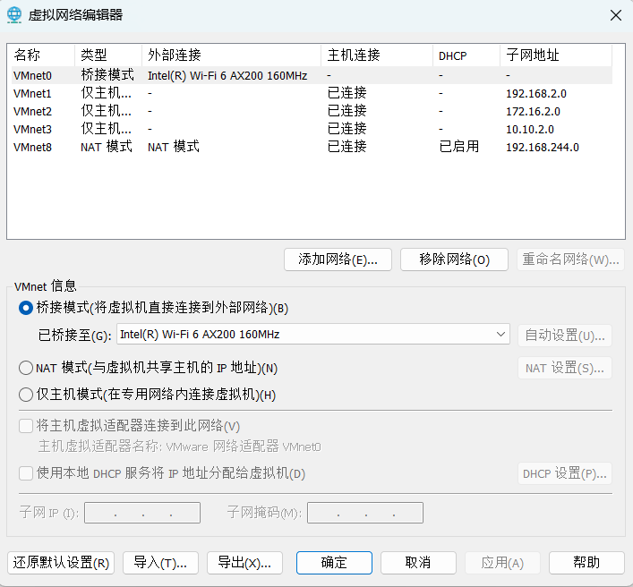

# dmz防火墙配置与邮件服务的搭建

## 第一部分

### 一、配置网络

建立四台主机，一个作为内网客户端，一个作为防火墙，一个作为dmz服务器，一个连通外网。



内网客户端(inner)：一块网卡（vmnet1）ip：192.168.2.2


防火墙(firewalld)：三块网卡（vmnet1 ip：192.168.2.1）(vmnet2 ip: 172.16.2.1) (vmnet3 ip: 10.10.2.1)


dmz服务器(dmz)：一块网卡（vmnet2 ip：172.16.2.2）


外网主机(outer):  两块网卡（vmnet3 ip：10.10.2.2）（vmnet0 桥接物理网卡）


### 二、在内网、dmz和外网主机配置路由，使得能够互相访问

inner脚本

```
@echo off   
route add 172.16.2.0 mask 255.255.255.0 192.168.2.1 
route add 10.10.2.0 mask 255.255.255.0 192.168.2.1
```

dmz脚本

```
@echo off   
route add 192.16.2.0 mask 255.255.255.0 172.16.2.1 
route add 10.10.2.0 mask 255.255.255.0 172.16.2.1
```

outer脚本

```
@echo off   
route add 172.16.2.0 mask 255.255.255.0 10.10.2.1 
route add 192.168.2.0 mask 255.255.255.0 10.10.2.1
```

在防火墙上配置路由转发

```
echo "net.ipv4.ip_forward = 1"  >> /etc/sysctl.conf
```

### 三、测试网络连通性

防火墙与其它主机连通性


inner与其它主机连通性

​                                       

dmz与其它主机连通性


outer与其它主机连通性


## 第二部分

### 一、服务配置

在防火墙配置dns，安装named  服务

```
yum install -y bind bind-chroot bind-utils
yum install -y bind*
```

在/etc目录下编辑named.conf文件


在/etc/下编辑named.rfc1912.zones文件


在/var/named目录下复制named.localhost

```
cp -a named.localhost b.cn.zone
cp -a named.localhost dev.a.com.zone
```

对b.cn.zone进行设置


对dev.a.com.zone进行设置


在/var/named目录下复制named.loopback

```
cp -a named.loopback 3.16.172.zone
cp -a named.loopback 6.16.172.zone
```

对3.16.172.zone进行设置


对6.16.172.zone进行设置


对named.ca修改


然后重新启动named服务，发现没有问题


在dmz配置dns，安装dns服务器

在正向查找区域新建a.com主要区域，并建立主机和邮件交换机


在正向查找区域新建b.cn辅助区域，ip地址填防火墙b.cn.zone的ip 172.16.2.1


在outer配置dns，安装dns服务器

在正向查找区域新建根域，再在根域下新建域，然后委派


在正向查找区域新建c.edu主要区域，然后新建主机和邮件交换机器


| 成员姓名 | 具体工作                       | 评分 |
| :------- | :----------------------------- | :--- |
| 苏嘉诺   | 查阅资料，编辑代码             | 97   |
| 刘少杰   | 建立虚拟机，配置网络，配置服务 | 140  |
| 吕仕通   | 查资料                         | 97   |
| 倪涛     | 整理文档                       | 90   |
| 王晓佳   | 整理文档                       | 90   |
| 程宇     | 美工                           | 95   |
| 聂晓伟   | 调试                           | 90   |
| 王小鹏   | 调试                           | 100  |

